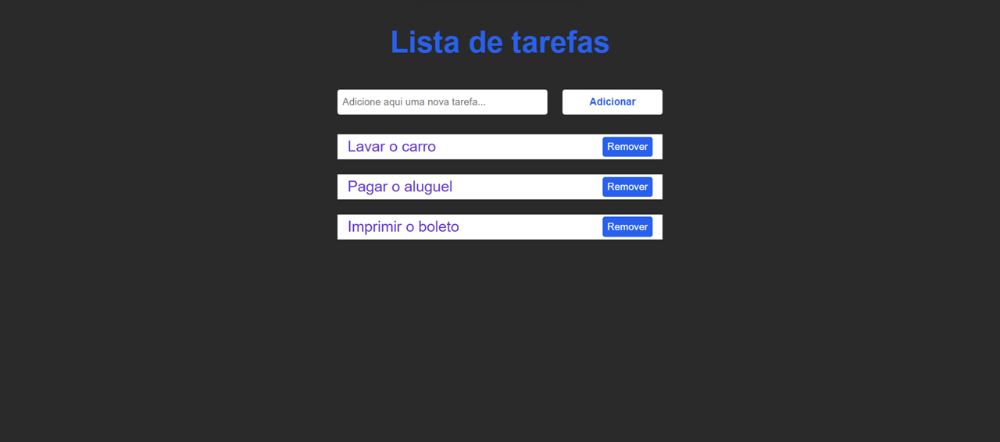
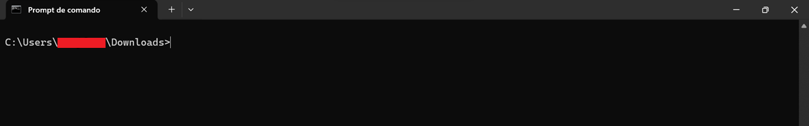
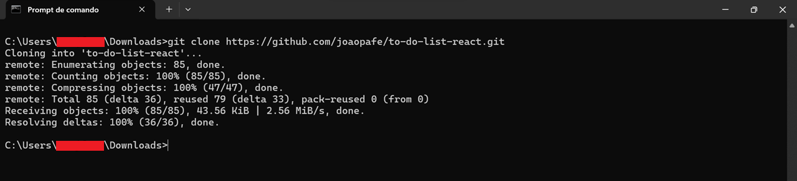
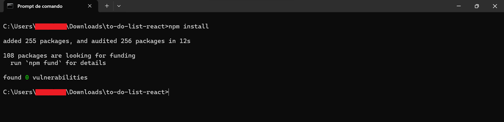
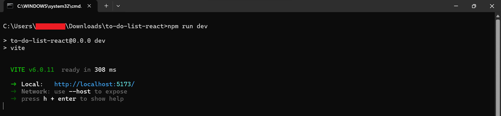

# To do list react

This project is a simple to-do list application using react. The purpose of creating this project is merely for personal studies.

It is possible to create and delete activities from the to-do list, in addition to being able to mark that it is completed.



## How to execute the project

### Node.js installation

To run the project you need to have node.js installed on your machine. Installation can be done via the following website: https://nodejs.org/en

### Repository cloning

To clone the repository, open the root folder where the project will be cloned within the command prompt:



Having already opened the folder where the project will be cloned, run the following command:

```
git clone https://github.com/joaopafe/to-do-list-react.git
```

The following return should be displayed:



### Installation of dependencies

Having already opened the project's root folder in the command prompt, with it having already been cloned, you will need to execute the following command:

```
npm install
```

The following return should be obtained:



With this, the dependencies will already be installed.

### Running the project

To run the project, you need to run the following command in the project root folder (after the dependencies are already properly installed).

```
npm run dev
```

The following return should be obtained:



As can be seen in the image, the address where the application is running is displayed under "location". Just use the address entered in the browser to access the project.
